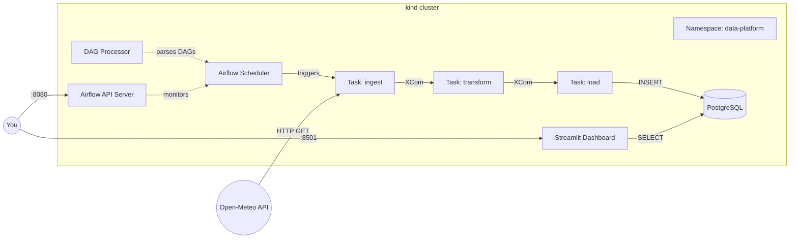
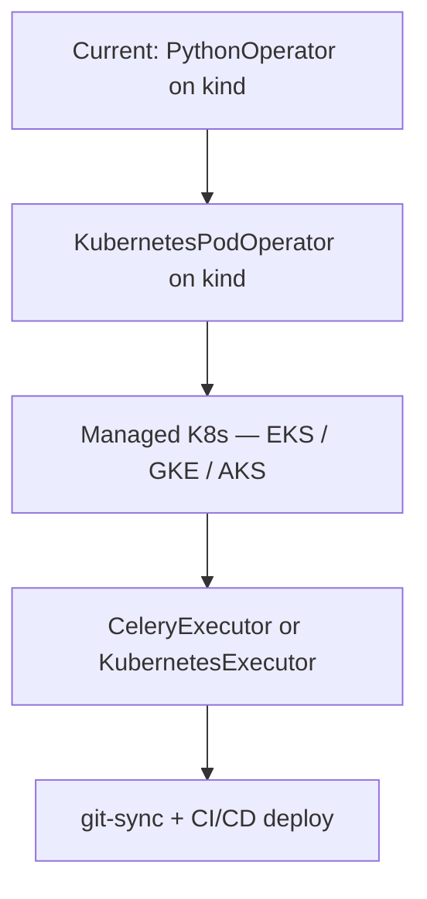

# Architecture

## High-Level Data Flow



## Component Map

| Component | What it does | K8s resource |
|-----------|-------------|--------------|
| **Airflow API Server** | UI + REST API for monitoring DAG runs (Airflow 3.x) | `Deployment` + `Service` (port 8080) |
| **Airflow Scheduler** | Schedules task instances, runs tasks via LocalExecutor | `StatefulSet` |
| **Airflow DAG Processor** | Parses DAG files and syncs definitions to the DB | `Deployment` |
| **Airflow Triggerer** | Runs deferred / async triggers | `StatefulSet` |
| **Airflow StatsD** | Collects Airflow metrics | `Deployment` |
| **PostgreSQL** | Airflow metadata **+** `weather_observations` table | `StatefulSet` (bundled by Helm chart) |
| **Streamlit Dashboard** | Reads `weather_observations` and displays live charts | `Deployment` + `Service` (port 8501) |
| **Namespace `data-platform`** | Isolates all resources from `default` | `manifests/namespace.yaml` |

> **Airflow 3.x note:** The standalone *webserver* was replaced by the
> *API server*. DAG parsing moved from the scheduler into a dedicated
> *dag-processor* pod. When copying DAGs manually, files must go into both
> the scheduler **and** dag-processor pods.

### Pipeline Flow

```
ingest (PythonOperator)
  │  Calls shared/ingest.py → fetches JSON from Open-Meteo API
  │  Pushes raw record to XCom
  ▼
transform (PythonOperator)
  │  Calls shared/transform.py → flattens to a warehouse-ready row
  │  Pushes row to XCom
  ▼
load (PythonOperator)
  │  Calls shared/load.py → INSERT INTO weather_observations
  │  Writes to the cluster's PostgreSQL
  ▼
dashboard (Streamlit)
     Reads weather_observations → shows metrics, charts, table
```

With `LocalExecutor` the scheduler runs tasks in-process — no separate
worker pods or Redis broker are needed for a single-node demo.

---

## How It Fits the Multi-Cloud Pattern

```
┌───────────────────────────────────────────────────────┐
│                     shared/                           │
│   ingest.py  ·  transform.py  ·  requirements.txt    │
└──────────┬──────────┬──────────┬──────────┬───────────┘
           │          │          │          │
     aws-data    gcp-data   azure-data   k8s-airflow
     -pipeline   -pipeline  -pipeline    -data-platform
           │          │          │          │
       Lambda    Cloud Fn    Azure Fn   Airflow on K8s
     EventBridge Scheduler  Data Fact.  Helm + kind
```

Each companion repo wraps the **same `shared/` functions** with a
cloud-specific compute + trigger layer. This repo replaces the managed
triggers with **Airflow's scheduler** running on Kubernetes, proving you can
move the pipeline to any environment with a K8s cluster.

---

## Design Decisions

### Why kind?

| Consideration | kind | minikube |
|---------------|------|----------|
| Runtime | Runs K8s nodes as Docker containers | Runs a VM (or Docker) |
| Startup speed | ~30 s | ~60–90 s |
| Multi-node support | Yes (config file) | Limited |
| CI-friendly | Widely used in K8s upstream CI | Less common |
| Resource overhead | Low — no VM layer | Higher when using HyperKit/VirtualBox |

**Verdict:** kind is the lighter, faster option for a portfolio project that
already requires Docker.

### Why the official Airflow Helm chart?

- Maintained by the Apache Airflow community — tracks upstream releases
  closely.
- Sensible production defaults (health checks, anti-affinity, PDBs) that
  you can scale down for a demo via `values.yaml` overrides.
- Built-in support for `git-sync` sidecar to auto-pull DAGs from a repo.

### Why `LocalExecutor`?

The default chart installs `CeleryExecutor` which needs Redis + worker pods.
For a single-node kind cluster, `LocalExecutor` cuts resource usage in half
and removes a class of debugging issues (broker connectivity, worker
scaling) that aren't relevant to the demo.

### Why `PythonOperator` before `KubernetesPodOperator`?

`PythonOperator` lets you validate the pipeline logic in seconds.
`KubernetesPodOperator` is the production upgrade path — it gives each task:

- Its own container image & dependency tree
- CPU / memory resource limits
- Fault isolation (OOM in one task doesn't kill the scheduler)

The TODO list in the README tracks this planned migration.

---

## Upgrade Path to Production



1. **Containerize each task** — Build Docker images for `ingest` and
   `transform`, push to a registry.
2. **Switch to `KubernetesPodOperator`** — Reference those images; add
   resource requests/limits.
3. **Move to a managed cluster** — Swap `kind` for EKS/GKE/AKS; update
   `kubeconfig`.
4. **Scale the executor** — Switch to `CeleryExecutor` or
   `KubernetesExecutor` for parallel task execution.
5. **Automate DAG delivery** — Enable `git-sync` in Helm values pointing at
   this repo; add a CI pipeline to lint & test DAGs on every push.
