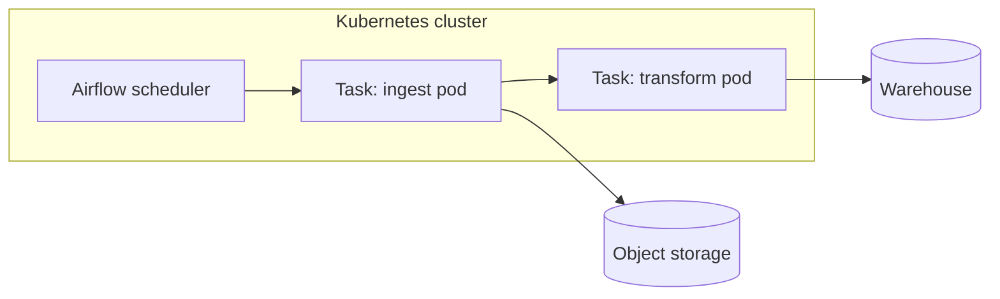

# Architecture

This repo is the orchestration-focused counterpart to `aws-data-pipeline`,
`gcp-data-pipeline`, and `azure-data-pipeline` — same `shared/` ingest +
transform logic, but the scheduling/triggering layer is Airflow on
Kubernetes instead of EventBridge / Cloud Scheduler / Data Factory.
